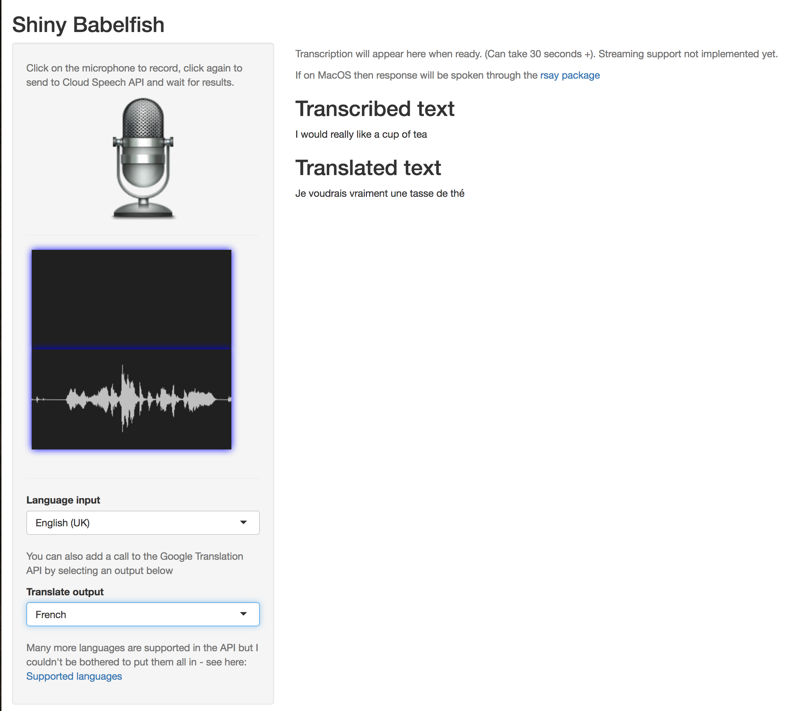

# Google Cloud Speech API Shiny app

This is a demo on using the [Cloud Speech API](https://cloud.google.com/speech/) with Shiny. 

It uses `library(tuneR)` to process the audio file, and a JavaScript audio library from [Web Audio Demos](https://webaudiodemos.appspot.com/AudioRecorder/index.html) to capture the audio in your browser.

You can also optionally send your transcription to the [Cloud Translation API](https://cloud.google.com/translate/)

If on MacOS, the results will also be spoken to you via the library [`rsay`](https://github.com/sellorm/rsay)

## Screenshot

